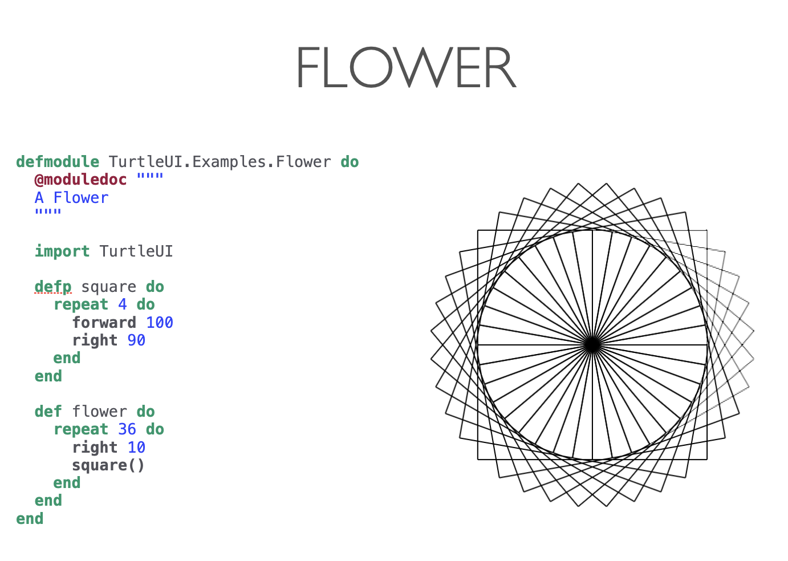
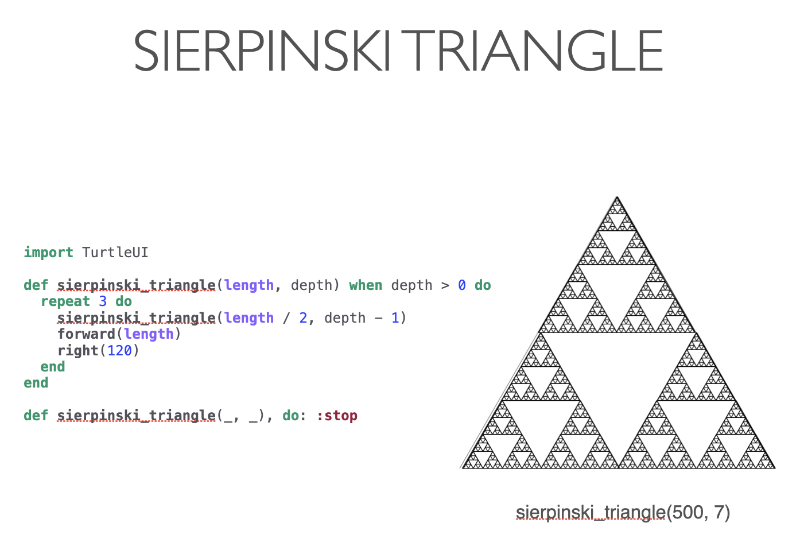
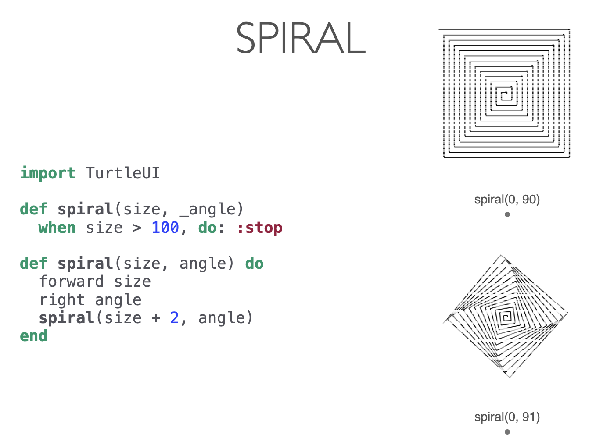
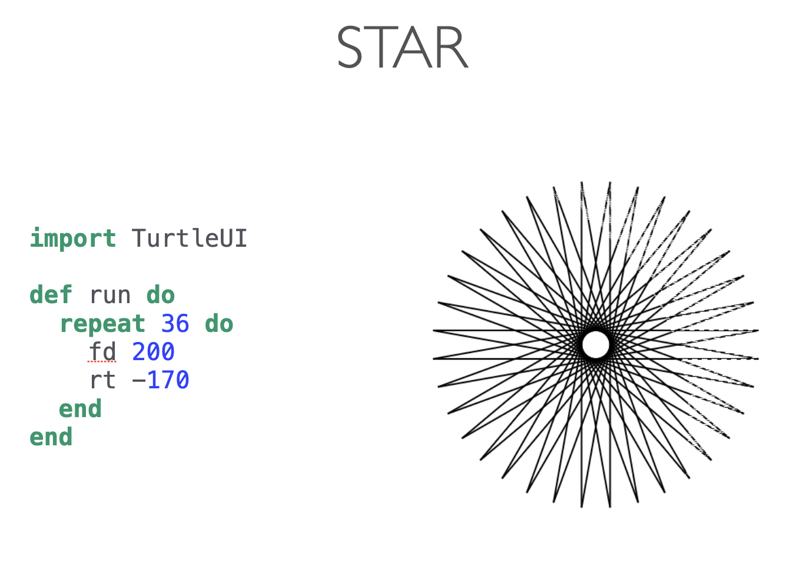

# Turtle

Turtle Graphics is a popular way to teach programming, particularly for kids. It
was initially part of the Logo programming language, created by Wally Feurzing
and Seymour Papert in 1966. Imagine a robotic turtle that starts in `{0,0}` on
the cartesian plane. After importing the `Turtle` module, you would be able to
use `IEx` (the interactive shell for Elixir) to send commands like `forward(15)`
and get the turtle to advance 15 pixels forward, drawing a line while moving.
You can draw pretty complex figures and
pictures by combining that with other commands.

This repository includes an experimental Elixir implementation about the
previous ideas, it should allow users to do all that using the Scenic
framework.

## How to run the examples

```console
$ cd turtle_ui
$ iex -S mix
```

And then, inside IEx you can do:

```elixir
iex(1)> c "examples/tree.ex"
iex(2)> TurtleUI.pen_down()
:ok
iex(3)> TurtleUI.Examples.Tree.example()
:ok
```

See the result on Scenic. If you want to run another example, you first need to
clean your view and then execute the next example like this:

```elixir
iex(4)> c "examples/sierpinski_triangle.ex"
iex(5)> TurtleUI.reset()
:ok
iex(6)> TurtleUI.Examples.SierpinskiTriangle.example()
:ok
```

You can also opt to compile all the examples at once by doing something like:

```elixir
iex(7)> for file <- Path.wildcard("examples/*.ex"), do: Code.compile_file(file)
```

In the directory `turtle_ui/examples` you can find more examples, here I show you some of them:









## TODO

### Turtle Motion

#### Move & Draw

* [x] `forward/1` (alias: `fd/1`) - Move the turtle forward by the specified distance.
* [x] `backward/1` (aliases: `bk/1`, `back/1`) - Move the turtle backward by given distance.
* [x] `right/1` (alias: `rt/1`) - Turn turtle right by _angle_ units (_degress_ by default).
* [x] `left/1` (alias: `lt/1`) - Turn turtle left by _angle_ units (_degress_ by default).
* [x] `go_to/1` - Move turtle to an absolute position.
* [x] `go_to/2` - Move turtle to an absolute position.
* [x] `set_x` - Set the turtle's x coordinate.
* [x] `set_y` - Set the turtle's y coordinate.
* [x] `set_heading` - Set the turtle's orientation to _angle_.
* [x] `home` - Move turtle to origin coordinates (0, 0) and set its heading to its start orientation.
* [ ] `circle` - Draw a circle with given radius.
* [ ] `dot` - Draw a circular dot with diameter size, using color.
* [x] `undo/0` - Undo the last turtle action(s).
* [ ] `speed` - Set the turtle's speed to an integer value in the range `0..10`, also allow to use _atoms_ like:
  - `:fastest`
  - `:fast`
  - `:normal`
  - `:slow`
  - `:slowest`

#### Turtle's state

* [x] `position/0` - Return the turtle's current location
* [x] `towards/1` - Return the angle between the line from turtle position to position specified by (x, y)
* [x] `towards/2`
* [x] `x_cor/0` - Return the turtle’s x coordinate.
* [x] `y_cor/0` - Return the turtle’s y coordinate.
* [x] `heading/0` - Return the turtle’s current heading
* [x] `distance/1` and `distance/2` - Return the distance from the turtle to (x, y)

#### Setting and measurement

* [ ] `degress` - Set angle measurement units, i.e. set number of “degrees” for
  a full circle. Default value is 360 degrees.
* [ ] `radians` - Set the angle measurement units to radians. Equivalent to `degrees(2*math.pi)`.

### Pen control

#### Drawing state

* [x] `pen_down/0` - Pull the pen down - drawing when moving.
* [x] `pen_up/0` - Pull the pen up - no drawing when moving.
* [x] `pen_size/0` - Return the line thickness.
* [x] `pen_size/1` - Set the line thickness.
* [x] `pen_down?/0` - Return `true` if pen is down, `false` if it's up.

#### Color control

* [x] `pen_color/0` - Return the pen color
* [x] `pen_color/1` - Set the pen color
* [ ] `fill_color/0` - Return the fill color
* [ ] `fill_color/1` - Set the fill color

#### Filling

* [ ] `fill/0` - Return `fill` state (`true` if filling).
* [ ] `fill/1` - Call `fill(true)` before drawing the shape you want to fill, and `fill(false)` when done.
* [ ] `begin_fill/0` - same as `fill(true)`
* [ ] `end_fill/0` - same as `fill(false)`

#### More drawing control

* [x] `reset` - delete the turtle's drawings from screen, re-center the turtle
      and set the variables to the default values
* [x] `clear` - delete the turtle’s drawings from the screen. Do not move
      turtle. State and position of the turtle as well as drawings of other
      turtles are not affected.

### Other improvements

* [ ] Add support `mode` (standard, logo)?
* [ ] Update arrow at the end of each movement
* [ ] Move functionality from `Home` scene into it own `turtle` Scenic Component?
* [ ] Support more than one Turtle, allow to set a cluster of turtles and share the state among them :)
* [ ] Improve README
* [ ] Improve examples. See this [issue](https://github.com/sunjay/turtle/issues/25) as a reference
* [ ] Add more doctest, more unit tests, property testing?
* [ ] Add a CHANGELOG https://keepachangelog.com/en/1.0.0/

## References

* https://docs.python.org/2/library/turtle.html#turtle.write
* https://github.com/sunjay/turtle
* https://cs.brown.edu/courses/bridge/1997/Resources/LogoTutorial.html
* http://www.logointerpreter.com/logo-reference/
* https://github.com/boydm/scenic
* https://en.m.wikipedia.org/wiki/Flood_fill
* https://github.com/buckle2000/turtle-playback/
